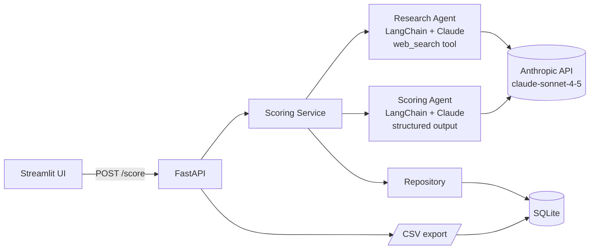

# Embrace Partnership Scoring Agent

An AI agent that scores healthcare organizations as potential partners for [Embrace](https://sendembrace.com), a startup that helps friends and family create video montages for patients facing serious illness. Give the agent an organization name and it returns a 0-100 fit score, a five-dimension breakdown, three suggested decision-makers, and a draft outreach email in under a minute. The agent compresses 20-30 minutes of manual prospect research into a single button click.

---

## Why I built this

I'm Atlas Lad, founder of Embrace. We're scaling from clinical pilots at Duke, UNC, and City of Hope to broader hospital-system and nonprofit partnerships, and our outbound team needs to qualify hundreds of prospect organizations every week. Manual research of pulling up an org's website, scanning leadership pages, hunting for digital health initiatives, sketching an outreach angle often takes 20-30 minutes per organization. Multiplied across our pipeline, that's the bottleneck on growth.

This agent is part of my application to the **Innovate Carolina summer fellowship at UNC Chapel Hill**. It's a working demo of how Embrace's BD team uses agentic AI to compress the discovery-to-outreach loop, and it's also the operational backbone we use today.

---

## Architecture



The agent layer is split into two LangChain runnables: a **research agent** (uses Anthropic's native `web_search` tool to gather public signals) and a **scoring agent** (consumes the research summary plus the rubric and emits a structured JSON score). The service layer orchestrates them, persists results in SQLite, and is wrapped by FastAPI routers. A thin Streamlit app consumes the API for the demo.

See [`docs/architecture.md`](docs/architecture.md) for a deeper walkthrough.

---
##Application View


---
## 5-minute quickstart

```bash
# 1. Clone
git clone https://github.com/<your-username>/embrace-partnership-agent.git
cd embrace-partnership-agent

# 2. Install (Python 3.11 recommended)
python3.11 -m venv .venv
source .venv/bin/activate
pip install -r requirements.txt

# 3. Add your Anthropic API key
cp .env.example .env
# then edit .env and paste your key into ANTHROPIC_API_KEY=

# 4. Run the demo
streamlit run streamlit_app.py
```

The Streamlit UI runs at `http://localhost:8501`. It boots the FastAPI backend in-process, so you only need the one command. To run them separately:

```bash
# terminal 1 — API
uvicorn app.main:app --reload --port 8000

# terminal 2 — UI
streamlit run streamlit_app.py
```

Run the test suite:

```bash
pytest -q
```

---

## Sample inputs and outputs

The repo ships with three pre-loaded examples in the Streamlit demo. Click any of the example buttons to score them without typing.

### 1. American Cancer Society: Tier A (expected ~88)

```json
{
  "organization_name": "American Cancer Society",
  "total_score": 88,
  "tier": "A",
  "dimensions": {
    "clinical_relevance": {"score": 20, "rationale": "..."},
    "mission_alignment":  {"score": 18, "rationale": "..."},
    "scale_and_reach":    {"score": 20, "rationale": "..."},
    "decision_maker_accessibility": {"score": 15, "rationale": "..."},
    "strategic_fit":      {"score": 15, "rationale": "..."}
  },
  "decision_makers": [
    {"title": "VP, Patient Support", "rationale": "...", "linkedin_query": "..."},
    {"title": "Director, Caregiver Programs", "rationale": "...", "linkedin_query": "..."},
    {"title": "Chief Mission Officer", "rationale": "...", "linkedin_query": "..."}
  ],
  "outreach_draft": "Hi [Name], — DRAFT — ...",
  "research_summary": "...",
  "scored_at": "2026-04-28T15:00:00Z"
}
```

### 2. CaringBridge: Tier A (expected ~90)

Pure mission alignment match: a 501(c)(3) social platform for patients and families navigating serious illness. Decision-makers cluster around Partnerships and Product.

### 3. Make-A-Wish Foundation: Tier B (expected ~70)

Strong on clinical relevance (pediatric serious illness) and scale (national chapter network), weaker on direct family-connection technology fit. Useful for partnership discussions but not a slam-dunk integration target.

> Sample outputs above are abbreviated for the README. Full JSON for each is in [`docs/demo.md`](docs/demo.md).

---

## API

| Method | Path | Purpose |
| --- | --- | --- |
| `POST` | `/score` | Score one organization. Body: `{organization_name, website?, notes?}`. |
| `GET` | `/partnerships` | Paginated list of all scored orgs. Query: `limit`, `offset`. |
| `GET` | `/partnerships/export` | CSV download of the full database. |
| `GET` | `/healthz` | Liveness probe. |

Interactive docs at `http://localhost:8000/docs` once the API is running.

---

## Scoring rubric

Five dimensions, 0-20 points each, total out of 100. Tier mapping: **A** ≥80, **B** 60-79, **C** 40-59, **Pass** <40.

1. **Clinical Relevance** — does the org serve patients with serious illness (oncology, neurology, cardiology, pediatric chronic disease, hospice, caregivers)?
2. **Mission Alignment** — does the org explicitly value emotional support, family connection, patient dignity, or psychosocial care?
3. **Scale & Reach** — how many patients/families could Embrace reach through this partnership?
4. **Decision-Maker Accessibility** — are VP-level or program-director contacts identifiable on LinkedIn or the org website?
5. **Strategic Fit** — recent signals indicating readiness (digital health initiatives, recent funding, public partnerships with similar startups, conference presence).

If web research fails, the agent falls back to scoring on the org name only and flags `research_quality: "limited"` in the response.

---

## Roadmap

- **Bulk CSV upload** — paste 200 orgs and get tiered output in a single run.
- **Clay.com enrichment** — push named decision-maker rows into Clay for contact lookup.
- **Cowork agent handoff** — when a Tier A is identified, hand the prospect to a sequenced-outreach Cowork agent.
- **Feedback loop** — track which Tier A leads convert and retrain the scoring prompts on outcomes.
- **Embedding cache** — embed prior research summaries so similar orgs reuse evidence.

---

## Project structure

```
embrace-partnership-agent/
├── app/
│   ├── main.py                # FastAPI entry point
│   ├── config.py              # Pydantic settings
│   ├── routers/partnerships.py
│   ├── services/scoring_service.py
│   ├── agents/
│   │   ├── research_agent.py  # LangChain + Anthropic web_search
│   │   └── scoring_agent.py   # LangChain + structured rubric output
│   ├── data/
│   │   ├── models.py          # SQLAlchemy
│   │   └── repository.py
│   └── prompts/
├── streamlit_app.py
├── tests/
└── docs/
```

---

## Credits

Built by Atlas Lad ([@SALTADAL](mailto:atlas.m.lad@gmail.com)) for Embrace. Inspired by the BD ops needs of healthcare startups scaling from pilots to systems.

## License

MIT — see [`LICENSE`](LICENSE).

> All AI-generated outreach drafts are clearly labeled as drafts and are never auto-sent. The agent never fabricates contact emails or phone numbers; it only returns role titles and LinkedIn search queries.
