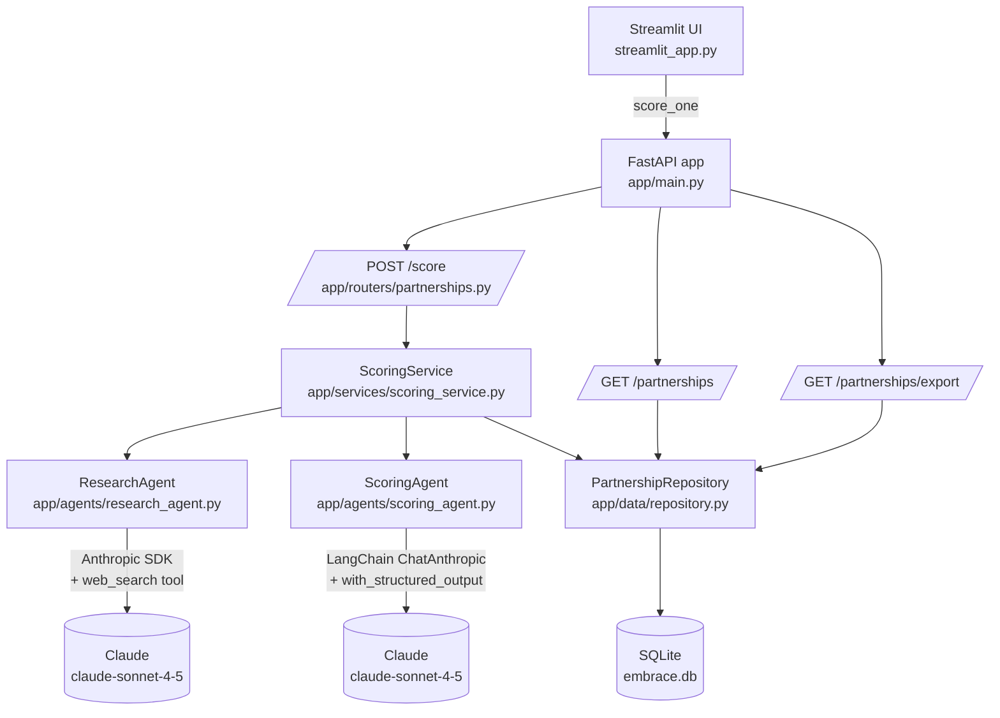

# Architecture

## One-paragraph summary

The Embrace Partnership Scoring Agent is a small FastAPI service backed by SQLite, with a Streamlit demo UI on top. The interesting work happens in the **agent layer**: a research agent that uses Anthropic's native `web_search` tool to gather first-party evidence about an organization, and a scoring agent that consumes that evidence and emits a structured rubric score plus a draft outreach email. A thin service layer orchestrates the two agents, persists the result to SQLite, and is what the routers depend on. Every external collaborator is dependency-injected so the test suite can run the full surface area without ever touching the network.

## Diagram

## Request lifecycle for `POST /score`

1. **Validation.** The router validates the body against `ScoreBody` (Pydantic). Bad inputs return `422`.
2. **Research.** `ScoringService.score(...)` calls `ResearchAgent.research(...)`. The research agent makes a single call to Claude with the `web_search_20250305` server-side tool enabled (capped at `WEB_SEARCH_MAX_USES` rounds). Tenacity retries 3× with 1s/2s/4s exponential back-off on transient errors. On hard failure or empty response, the agent returns a `ResearchResult` with `research_quality="limited"` instead of raising.
3. **Scoring.** The service hands the brief to `ScoringAgent.score(...)`. The scoring agent uses LangChain's `ChatAnthropic.with_structured_output(ScoreOutput)` so Claude is forced to emit JSON that parses into our Pydantic schema. The schema has a `field_validator` that prepends `[DRAFT]` to the outreach email if Claude forgets — guaranteeing the contract.
4. **Computation.** The service sums the five 0–20 dimension scores and maps the total to a tier (`A`/`B`/`C`/`Pass`) via `compute_tier`.
5. **Persistence.** `PartnershipRepository.save(...)` writes one row to SQLite. The full response payload is also stored as JSON for replay.
6. **Response.** The router returns the structured payload. If the scoring agent fails after retries, the router returns `502`. Anything else unexpected becomes a `500` — but routine timeouts during research are absorbed by the limited-research fallback, so this is rare.

## Why the agent layer is split in two

A single Claude call could in principle do both research *and* score, but separating them is worth the round-trip:

- **Different prompts evolve at different rates.** The scoring rubric is the contract with the BD team; we want it stable. The research prompt evolves more often (new sources, new sections we want surfaced). Splitting lets us iterate without churn.
- **Different output formats.** Research wants free-form prose with web citations interleaved. Scoring wants strict JSON. Mashing them produces a model that's mediocre at both.
- **Different retry semantics.** Research can degrade to "limited" gracefully. Scoring cannot — a malformed JSON ruins the whole response. Tenacity policies differ.

## Why the libraries we chose

| Concern | Choice | Reason |
| --- | --- | --- |
| Web framework | FastAPI | Native Pydantic validation, auto-docs at `/docs`, async-ready. |
| Frontend | Streamlit | Single command to demo on a MacBook Air. No build step. |
| ORM | SQLAlchemy 2.0 | Industry default; the `JSON` column type is perfect for replay payloads. |
| Agent orchestration | LangChain | `with_structured_output` is the cleanest way to enforce a Pydantic schema. |
| LLM | Anthropic Claude (`claude-sonnet-4-5`) | Best-in-class at structured output and the only model with a server-side `web_search` tool — no scraping libraries needed. |
| Retries | Tenacity | Battle-tested decorator-based retry with exponential back-off. |
| Settings | Pydantic Settings | Typed env var loading; one source of truth. |

## What's not in scope

- Authentication on the API — the demo runs locally for the fellowship reviewer.
- A queue or worker pool — one scoring run per request is fine at hundreds of orgs/week.
- Caching — easy to add via embedding similarity once we have signal on what duplicates look like.

## Dev loop

- `pytest -q` runs the full test suite against stubbed agents — no API key required.
- `black --check .` and `flake8 app/` pass with zero warnings (configured in `pyproject.toml` and `.flake8`).
- The Streamlit UI calls the service in-process (`app.main.score_one`); the FastAPI app is also fully usable on its own (`uvicorn app.main:app --reload`).
